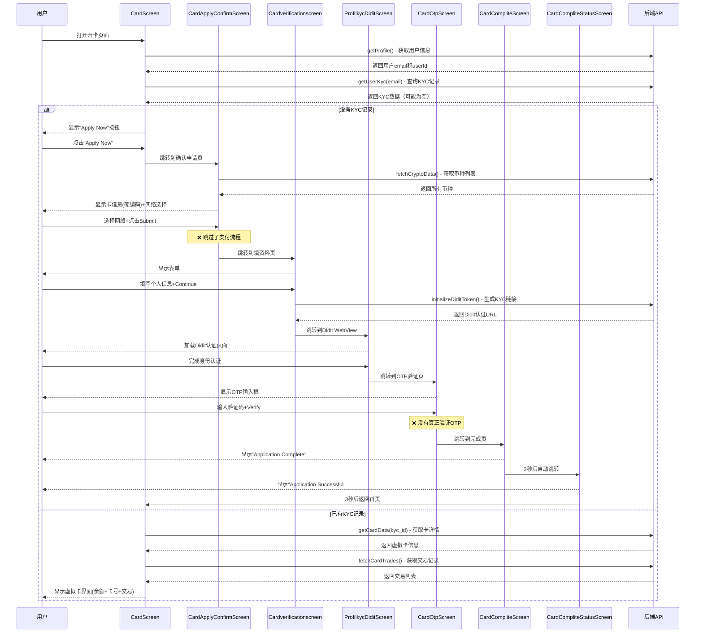

# 现有开卡流程完整梳理

> **梳理时间**：2025-12-24  
> **目的**：理清现有代码的开卡逻辑、页面跳转和 API 调用

---

## 📱 页面流程图

```
CardScreen (开卡首页)
    ↓ 点击"ApplyNow"按钮
CardApplyConfirmScreen (确认申请页)
    ↓ 选择网络 + 点击Submit
Cardverificationscreen (填写资料页)
    ↓ 填写个人信息 + Continue
ProfilkycDiditScreen (Didit KYC认证页 - WebView)
    ↓ WebView完成认证
CardOtpScreen (OTP验证页)
    ↓ 输入验证码
CardCompliteScreen (申请完成页)
    ↓ 自动跳转
CardCompliteStatusScreen (状态页)
    ↓ 返回首页
```

---

## 🔍 详细页面分析

### 1️⃣ CardScreen.dart - 开卡首页

**文件路径**: `lib/views/homes/CardScreen.dart`

#### 页面功能

- 如果用户**已有 KYC 记录** → 显示虚拟卡界面（余额、卡号、交易记录）
- 如果用户**没有 KYC 记录** → 显示申请页面（Apply Now 按钮）

#### 调用的接口

| API 调用       | 方法/Service                                 | 作用                               |
| -------------- | -------------------------------------------- | ---------------------------------- |
| 获取用户信息   | `ProfileScreenViewModel.getProfile()`        | 获取当前登录用户的 email 和 userId |
| 查询 KYC 数据  | `KycService.getUserKyc(email)`               | 查询该用户是否已提交 KYC 申请      |
| 获取卡详情     | `ProfileScreenViewModel.getCardData(kyc_id)` | 如果有 KYC 记录，获取虚拟卡详情    |
| 创建虚拟卡     | `ProfileScreenViewModel.createCard()`        | 如果卡数据为空，尝试创建卡         |
| 获取卡交易记录 | `CardTradeViewModel.fetchCardTrades()`       | 获取虚拟卡的交易历史               |

#### 核心逻辑代码

```dart
// 第85-121行：加载用户信息
Future<void> _loadProfile() async {
  final accessToken = HiveStorageService.getAccessToken();
  final success = await _viewModel.getProfile(accessToken);
  if (success) {
    email = _viewModel.profileResponse?.user.email;
    userId = _viewModel.profileResponse?.user.id.toString();

    // 如果有email，加载KYC数据
    if (email != null) {
      await _loadKycData(email!);
    }
  }
}

// 第123-151行：加载KYC数据
Future<void> _loadKycData(String kycEmail) async {
  final kycService = KycService();
  final result = await kycService.getUserKyc(kycEmail);
  // 如果有KYC数据，再加载卡数据
  await _loadCardData(kycData[0].id);
}

// 第153-214行：加载卡数据
Future<void> _loadCardData(int kyc_id) async {
  final cardResponse = await _viewModel.getCardData(kyc_id);

  if (cardResponse != null) {
    _cardDetailData = cardResponse.data;
    _showBlankScreen = (_kycTotal != null && _kycTotal! >= 1);
  } else {
    // 如果没有卡数据，尝试创建卡
    await _viewModel.createCard(_kycData!, _viewModel.profileResponse!);
  }
}
```

#### API 端点详情

**1. 获取用户 KYC 记录**

```dart
// KycService.dart
baseUrl: 'http://31.97.222.142:2050/api'
GET /kyc?page=1&limit=10&email=xxx@qq.com

返回示例：
{
  "code": 200,
  "data": {
    "total": 1,
    "list": [{
      "id": 123,
      "email": "xxx@qq.com",
      "first_name": "John",
      "last_name": "Doe",
      "status": 1,
      ...
    }]
  }
}
```

#### 页面跳转

```dart
// 第672-679行：点击"Apply Now"按钮
Navigator.push(
  context,
  MaterialPageRoute(
    builder: (context) => const CardApplyConfirmScreen(),
  ),
);
```

---

### 2️⃣ CardApplyConfirmScreen.dart - 确认申请页

**文件路径**: `lib/views/homes/CardApplyConfirmScreen.dart`

#### 页面功能

1. 显示卡信息（**硬编码**）：
   - 卡名称: "Come Come Pay Card"
   - 卡组织: "VISA"
   - 卡费: "5 USD"
2. 让用户选择支付网络（实际是币种）
3. 点击 Submit 跳转到下一步

#### 调用的接口

| API 调用     | 方法/Service                              | 作用                                    |
| ------------ | ----------------------------------------- | --------------------------------------- |
| 获取币种列表 | `TokenReceiveViewModel.fetchCryptoData()` | 获取所有支持的币种（BTC, ETH, USDT 等） |

**⚠️ 注意**：这个接口不是专门的支付币种接口，是收款币种接口

#### 核心逻辑代码

```dart
// 第19-22行：初始化时获取币种列表
ChangeNotifierProvider<TokenReceiveViewModel>(
  create: (context) => TokenReceiveViewModel()
    ..fetchCryptoData()  // 获取所有币种
    ..setTotalAssets(0.0),
)

// 第74行：显示网络选择行
_buildNetworkSelectionRow(viewModel)

// 第182-227行：构建网络选择UI
Widget _buildNetworkSelectionRow(TokenReceiveViewModel viewModel) {
  return GestureDetector(
    onTap: () {
      _showNetworkSelectionBottomSheet(viewModel);
    },
    child: Container(...显示选择的网络...)
  );
}

// 第241-309行：弹出网络选择弹窗
void _showNetworkSelectionBottomSheet(TokenReceiveViewModel viewModel) {
  showModalBottomSheet(
    // 显示所有币种列表（过滤掉HKD）
    itemBuilder: (context, index) {
      final token = viewModel.filteredTokens[index];
      if (token['symbol'] == 'HKD') {
        return const SizedBox.shrink();
      }
      return _buildNetworkItem(token);
    }
  );
}
```

#### 页面跳转

```dart
// 第82-101行：点击Submit按钮
onPressed: _selectedNetwork == null
  ? null
  : () async {
      // TODO: 将选择的网络地址发送到后端
      final networkAddress = _selectedNetwork!['address'] ?? 'mock_address';

      // ❌ 跳过了支付环节，直接跳到KYC填资料页面
      Navigator.push(
        context,
        MaterialPageRoute(
          builder: (context) => const Cardverificationscreen(),
        ),
      );
    }
```

**🔴 关键问题**：

- 没有创建支付订单
- 没有选择优惠券功能
- 选择的网络地址没有被使用
- 直接跳过了支付流程

---

### 3️⃣ Cardverificationscreen.dart - 填写资料页

**文件路径**: `lib/views/homes/CardVerificationScreen.dart`

#### 页面功能

用户填写 KYC 所需的个人信息：

- Name (姓名 - 大写英文)
- Surname (姓氏 - 大写英文)
- Mobile Phone (手机号)
- Country / Region (国家/地区)
- State / Province (州/省)
- City (城市)
- Detailed Address (详细地址)
- Post Code (邮编)

#### 调用的接口

| API 调用           | 方法/Service                                    | 作用                    |
| ------------------ | ----------------------------------------------- | ----------------------- |
| 初始化 Didit Token | `ProfileScreenViewModel.initializeDiditToken()` | 生成 Didit KYC 认证链接 |

#### 核心逻辑代码

```dart
// 第182-241行：点击Continue按钮
onPressed: () async {
  if (_formKey.currentState!.validate()) {
    // 验证姓名只能是大写英文字母
    if (!_validateEnglishUppercase(_nameController.text, 'Name')) return;
    if (!_validateEnglishUppercase(_surnameController.text, 'Surname')) return;

    // 获取用户email
    final user = HiveStorageService.getUser();
    final email = user?.email ?? '';

    // 创建请求数据
    final request = DiditInitializeTokenRequestModel(
      address: _addressController.text,
      agentUid: '${_nameController.text}_${_surnameController.text}_${DateTime.now()}',
      areaCode: _selectedCode.replaceAll('+', ''),
      billCountryCode: _selectedCountry == 'China' ? 'CN' : ...,
      city: _cityController.text,
      email: email,
      firstEnName: _nameController.text.toUpperCase(),
      lastEnName: _surnameController.text.toUpperCase(),
      phone: _phoneNumberController.text,
      postCode: _postcodeController.text,
      returnUrl: 'https://yourapp.com/kyc/didit/callback',
      state: _stateController.text,
    );

    // 调用API初始化Didit Token
    final response = await _viewModel.initializeDiditToken(request);

    if (response != null && response.diditToken.data.url.isNotEmpty) {
      // 跳转到Didit WebView页面
      Navigator.push(
        context,
        MaterialPageRoute(
          builder: (context) => ProfilkycDiditScreen(
            url: response.diditToken.data.url,
          ),
        ),
      );
    }
  }
}
```

#### API 端点详情

**初始化 Didit KYC Token**

```dart
// ProfileScreenViewModel.dart
POST /api/v1/user/initialize-didit-token

请求参数：
{
  "address": "...",
  "agent_uid": "JOHN_DOE_1234567890",
  "area_code": "86",
  "bill_country_code": "CN",
  "city": "Beijing",
  "email": "user@example.com",
  "first_en_name": "JOHN",
  "last_en_name": "DOE",
  "phone": "13800138000",
  "post_code": "100000",
  "return_url": "https://yourapp.com/kyc/didit/callback",
  "state": "Beijing"
}

返回示例：
{
  "didit_token": {
    "data": {
      "url": "https://didit.xyz/verify?token=xxx"
    }
  }
}
```

---

### 4️⃣ ProfilkycDiditScreen.dart - Didit KYC 认证页

**文件路径**: `lib/views/homes/ProfilKycDiditScreen.dart`

#### 页面功能

- 使用 WebView 加载 Didit 的 KYC 认证页面
- 用户在 WebView 中完成身份认证（拍照、上传证件等）
- 完成后可能有回调

#### 调用的接口

**无直接 API 调用**，只是加载外部的 Didit 认证网页

#### 核心逻辑

```dart
// 使用WebView加载URL
WebView(
  initialUrl: widget.url,  // 从上一页传来的Didit URL
  javascriptMode: JavascriptMode.unrestricted,
)
```

---

### 5️⃣ CardOtpScreen.dart - OTP 验证页

**文件路径**: `lib/views/homes/CardOtpScreen.dart`

#### 页面功能

- 用户输入 6 位 OTP 验证码
- 验证通过后跳转到完成页

#### 调用的接口

**⚠️ 从代码看，没有实际调用验证 OTP 的 API**，只是 UI 展示

#### 核心逻辑

```dart
// 第100行：点击Verify按钮
Navigator.pushNamed(context, '/CardCompliteScreen');
```

**🔴 关键问题**：

- 没有调用后端验证 OTP 接口
- 直接跳转，没有真正验证

---

### 6️⃣ CardCompliteScreen.dart - 申请完成页

**文件路径**: `lib/views/homes/CardCompliteScreen.dart`

#### 页面功能

- 显示"Application Complete"的成功提示
- 3 秒后自动跳转到状态页

#### 调用的接口

**无 API 调用**

#### 核心逻辑

```dart
// 第17行：自动跳转
Navigator.pushReplacement(
  context,
  MaterialPageRoute(
    builder: (context) => const Cardcompletestatus(),
  ),
);
```

---

### 7️⃣ CardCompliteStatusScreen.dart - 状态页

**文件路径**: `lib/views/homes/CardCompliteStatusScreen.dart`

#### 页面功能

- 显示"Application Successful"
- 显示处理时间提示
- 3 秒后返回首页

#### 调用的接口

**无 API 调用**

#### 核心逻辑

```dart
// 第19行：自动返回首页
Navigator.pushReplacement(
  context,
  MaterialPageRoute(
    builder: (context) => const CardScreen(),
  ),
);
```

---

## 📊 完整流程时序图



---

## 🔧 Service 和 ViewModel 分析

### 使用的 Service

| Service                  | 用途                                 | Base URL                        |
| ------------------------ | ------------------------------------ | ------------------------------- |
| `KycService`             | 查询 KYC 记录                        | `http://31.97.222.142:2050/api` |
| `ProfileScreenViewModel` | 用户信息、初始化 Didit Token、卡数据 | 默认 BaseService                |
| `TokenReceiveViewModel`  | 获取币种列表                         | 默认 BaseService                |
| `CardTradeViewModel`     | 获取卡交易记录                       | 默认 BaseService                |

### 调用的 API 汇总

| API 端点                                   | 方法                   | 作用          | 在哪个页面             |
| ------------------------------------------ | ---------------------- | ------------- | ---------------------- |
| `GET /api/v1/user/profile`                 | getProfile()           | 获取用户信息  | CardScreen             |
| `GET /kyc`                                 | getUserKyc(email)      | 查询 KYC 记录 | CardScreen             |
| `GET /api/v1/card/detail`                  | getCardData(kyc_id)    | 获取卡详情    | CardScreen             |
| `POST /api/v1/card/create`                 | createCard()           | 创建虚拟卡    | CardScreen             |
| `GET /api/v1/card/trades`                  | fetchCardTrades()      | 获取交易记录  | CardScreen             |
| `GET /api/v1/wallet/crypto-data`           | fetchCryptoData()      | 获取币种列表  | CardApplyConfirmScreen |
| `POST /api/v1/user/initialize-didit-token` | initializeDiditToken() | 生成 KYC 链接 | Cardverificationscreen |

---

## ❌ 现有流程的问题总结

### 1. **完全缺失支付逻辑**

- 从`CardApplyConfirmScreen`直接跳到`Cardverificationscreen`
- 中间没有任何支付相关的代码
- 用户没有机会支付开卡费

### 2. **硬编码数据**

```dart
// CardApplyConfirmScreen.dart
_buildInfoRow('Card fee', '5 USD', isClickable: false)  // 写死5美元
_buildInfoRow('Card name', 'Come Come Pay Card', isClickable: true)
_buildInfoRow('Card organization', 'VISA', isClickable: false)
```

### 3. **网络选择用途不明**

- 选择了网络（币种），但选择的地址没有被使用
- 代码中有 TODO 注释：`// TODO: 将选择的网络地址发送到后端`
- 实际上新接口需要的是从钱包扣款，不需要地址

### 4. **没有优惠券集成**

- `CardApplyScreen.dart`里有优惠券 UI，但是空实现
- 没有弹窗选择优惠券
- 没有传递优惠券到后端

### 5. **OTP 验证是假的**

- `CardOtpScreen`只是 UI 展示
- 没有调用后端验证 OTP 接口
- 直接点击就跳转，没有真正验证

### 6. **KYC 资格检查缺失**

- 没有调用`/api/v1/kyc/eligibility`检查用户是否已支付
- 理论上应该在跳转到 KYC 页面前检查

---

## 🎯 总结

### 当前实现的功能

✅ 用户信息获取  
✅ KYC 记录查询  
✅ 虚拟卡展示（如果已有卡）  
✅ KYC 资料填写表单  
✅ Didit 认证集成（WebView）  
✅ UI 流程完整

### 缺失的功能

❌ 开卡费动态配置  
❌ 创建支付订单  
❌ 选择优惠券  
❌ 选择支付币种  
❌ 完成支付（钱包扣款）  
❌ 支付状态查询  
❌ KYC 资格验证  
❌ OTP 真实验证

### 一句话总结

**现有代码只实现了"KYC 资料采集的 UI 流程"，完全没有"开卡费支付"的逻辑。用户看似走完了流程，实际上没有支付任何费用就提交了 KYC 申请。**

---

_梳理完成时间：2025-12-24_
